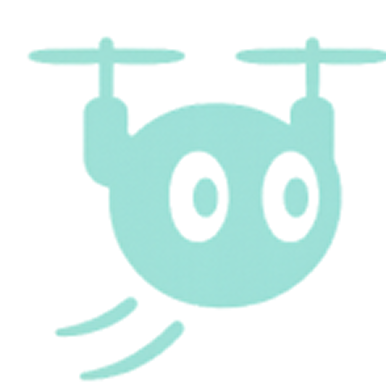
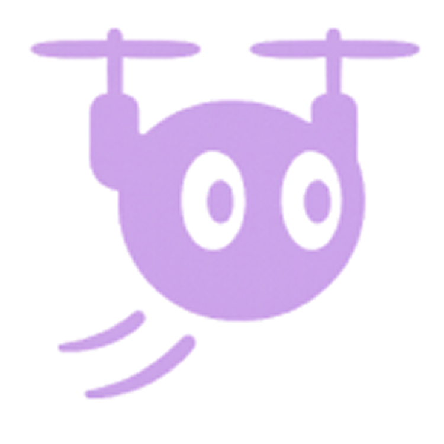
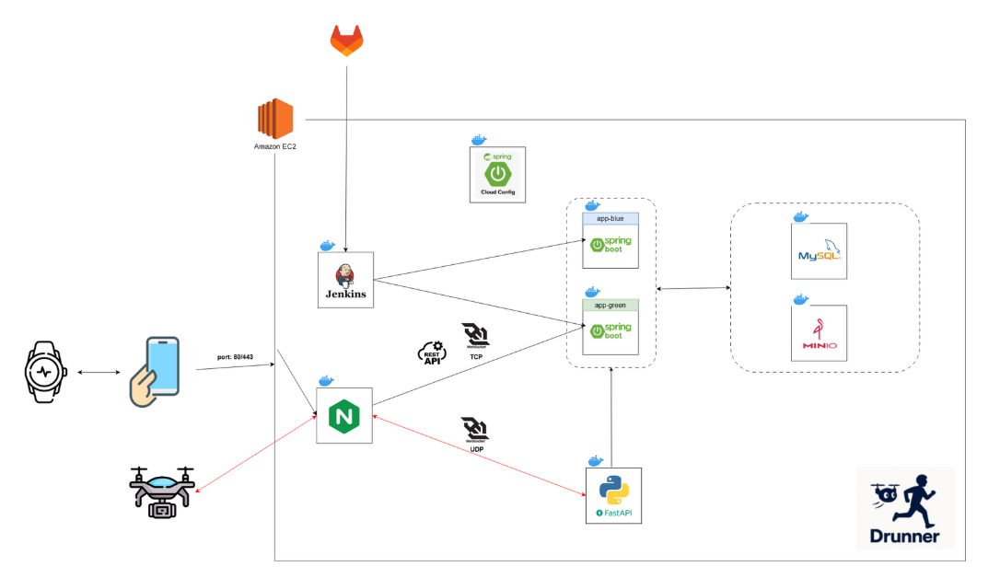
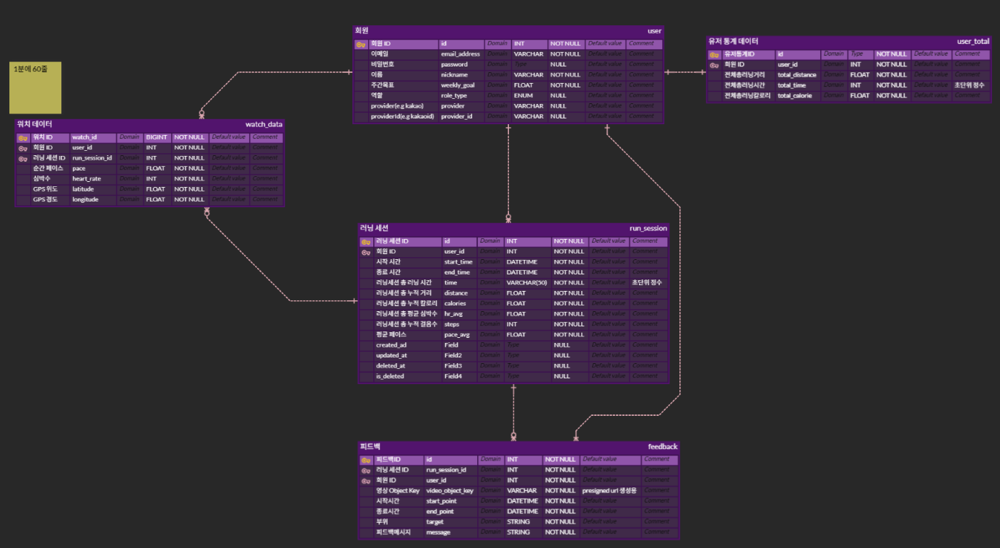
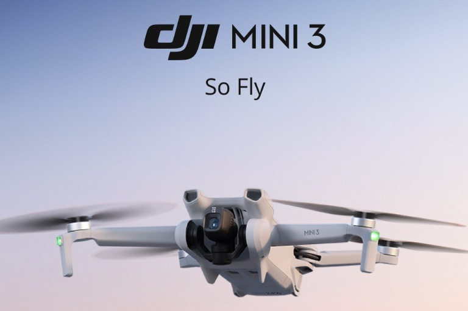

# Drunner - 스마트 러닝 서비스

 

# 목차

1. [프로젝트 개요](#프로젝트-개요)
2. [프로젝트 기간](#프로젝트-기간)
3. [팀원 소개](#팀원-소개)
4. [프로젝트 설계 및 구성](#프로젝트-설계-및-구성)  
   4-1. [서비스 아키텍처](#아키텍처)  
   4-2. [데이터베이스 설계](#데이터베이스-erd)
5. [사용 기술](#사용-기술)
6. [주요 기능](#주요-기능)

 

# 프로젝트 개요

### 🏃‍♀️ 혼자 뛰는 러닝, 아쉬운 점이 있지 않으셨나요?

> 러닝을 하며 **페이스 조절이 어렵고**, **자세 교정이나 피드백을 받기 힘들다**는 점은 많은 러너들의 공통된 고민입니다. 저희는 이러한 문제를 해결하기 위해, **드론을 활용한 스마트 러닝 서비스 `Drunner`** 를 개발했습니다.
>
> 📡 **실시간 자세 분석**, 🕒 **페이스 메이커 기능**, 📱 **운동 기록 관리**까지
> 이제 러닝은 혼자가 아닌, 하늘에서 함께합니다.

 

# 프로젝트 기간

### 2025.04.14 ~ 2025.05.22

 

# 팀원 소개

<table align="center">
  <tr>
    <td align="center" width="17%;">
      
       <b>이건우</b> 
      팀장 
      BE/AI
      
    </td>
    <td align="center" width="17%;">
      
       <b>김본</b> 
      팀원 
      DRONE
      
    </td>
    <td align="center" width="17%;">
      
       <b>유영신</b> 
      팀원 
      DRONE
      
    </td>
    <td align="center" width="17%;">
      
       <b>한슬기</b> 
      팀원 
      BE/INFRA
      
    </td>
    <td align="center" width="17%;">
      
       <b>박해구</b> 
      팀원 
      AOS
      
    </td>
  </tr>
</table>

 

# 프로젝트 설계 및 구성

## 아키텍처

## 데이터베이스 ERD

 

# 사용 기술

### 운영체제

- **로컬 개발 환경:**

  

- **서버 운영 환경:**

  
  

---

### IDE & Editor

---

### 버전 & 이슈 관리 및 협업 도구

---

### 배포 환경 및 빌드 도구

- AWS EC2 (Ubuntu `22.04`)
- Nginx `1.27.4`
- Docker `28.1.1`
- Docker Compose `2.35.1`
- Jenkins (CI/CD) `2.504.1`
- Gradle `8.11.1`

---

### Drone

- **드론 모델**

  **DJI Mini 3**

  

---

### AI

- **언어**

  

- **서버**

  

- **모델**

  

- **프레임워크 / 추론 알고리즘**

  
  

---

### BackEnd

- JAVA (OpenJDK `17.0.14`)
- SpringBoot `3.2.5`
- QueryDSL `5.1.0`
- Spring Cloud Config `4.2.2`

---

### FrontEnd(Mobile & WearOS)

- Kotlin `2.0.20`
- Jetpack Compose `2.0.20`
- Hilt `2.56.1`
- Retrofit `2.9.0`

---

### DB & Storage

- MySQL `8.0.41`
- Minio `RELEASE.2025-04-22T22-12-26Z`

 

# 주요 기술
