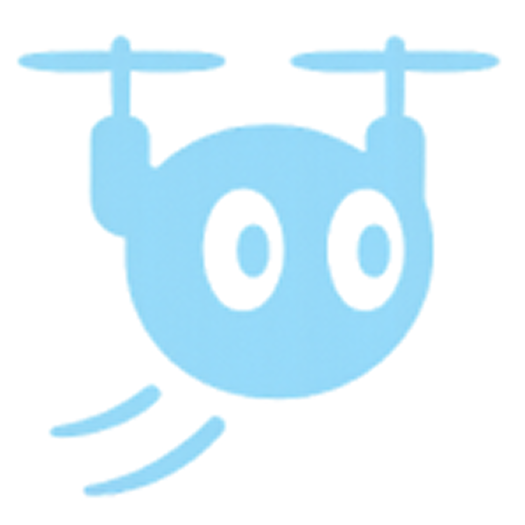
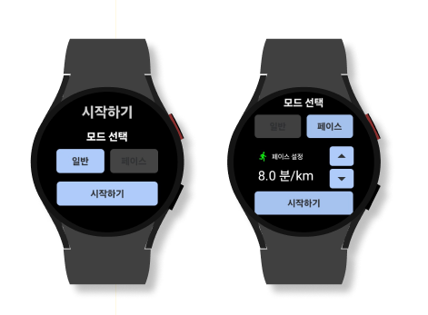

# Drunner - 하늘에서 시작되는 나의 러닝 다이어리

 

# 목차

1. [프로젝트 개요](#프로젝트-개요)
2. [프로젝트 기간](#프로젝트-기간)
3. [팀원 소개](#팀원-소개)
4. [프로젝트 설계 및 구성](#프로젝트-설계-및-구성)  
   4-1. [서비스 아키텍처](#아키텍처)  
   4-2. [데이터베이스 설계](#데이터베이스-erd)
5. [사용 기술](#사용-기술)
6. [주요 기술](#주요-기술)
7. [주요 기능](#주요-기능)

 

# 프로젝트 개요

### 🏃‍♀️ 혼자 뛰는 러닝, 아쉬운 점이 있지 않으셨나요?

> 러닝을 하며 **페이스 조절이 어렵고**, **자세 교정이나 피드백을 받기 힘들다**는 점은 많은 러너들의 공통된 고민입니다. 저희는 이러한 문제를 해결하기 위해, **드론을 활용한 스마트 러닝 서비스 `Drunner`** 를 개발했습니다.
>
> 📡 **실시간 자세 분석**, 🕒 **페이스 메이커 기능**, 📱 **운동 기록 관리**까지
> 이제 러닝은 혼자가 아닌, 하늘에서 함께합니다.

 

# 프로젝트 기간

### 2025.04.14 ~ 2025.05.22

 

# 팀원 소개

<table align="center">
  <tr>
    <td align="center" width="17%;">
      
       <b>이건우</b> 
      팀장 
      BE/AI
      
    </td>
    <td align="center" width="17%;">
      
       <b>김본</b> 
      팀원 
      DRONE
      
    </td>
    <td align="center" width="17%;">
      
       <b>유영신</b> 
      팀원 
      DRONE
      
    </td>
    <td align="center" width="17%;">
      
       <b>한슬기</b> 
      팀원 
      BE/INFRA
      
    </td>
    <td align="center" width="17%;">
      
       <b>박해구</b> 
      팀원 
      AOS
      
    </td>
  </tr>
</table>

 

# 프로젝트 설계 및 구성

## 아키텍처

## 데이터베이스 ERD

 

# 사용 기술

### 운영체제

- **로컬 개발 환경:**

  

- **서버 운영 환경:**

  
  

---

### IDE & Editor

---

### 버전 & 이슈 관리 및 협업 도구

---

### 배포 환경 및 빌드 도구

- AWS EC2 (Ubuntu `22.04`)
- Nginx `1.27.4`
- Docker `28.1.1`
- Docker Compose `2.35.1`
- Jenkins (CI/CD) `2.504.1`
- Gradle `8.11.1`

---

### AI

- **언어**

  

- **서버**

  

- **모델**

  

- **프레임워크 / 추론 알고리즘**

  
  

---

### BackEnd

- JAVA (OpenJDK `17.0.14`)
- SpringBoot `3.2.5`
- QueryDSL `5.1.0`
- Spring Cloud Config `4.2.2`

---

### FrontEnd(Mobile & WearOS)

- Kotlin `2.0.20`
- Jetpack Compose `2.0.20`
- Hilt `2.56.1`
- Retrofit `2.9.0`

---

### DB & Storage

- MySQL `8.0.41`
- Minio `RELEASE.2025-04-22T22-12-26Z`

---

### Drone

- **드론 모델**

  **DJI Mini 3**

  

 

# 주요 기술

### 1. 영상 정보 전송 & 피드백 알림 전송

- 드론 서버로부터 실시간 영상을 받기 위해 **`UDP Websocket`** 연결
- 워치로부터의 운동 데이터 수신 및 피드백 알림 전송을 위해 **`TCP Websocket`** 연결

### 2. 사용자 인식

- YOLO 11 모델을 사용하여 사용자를 인식
- **손의 포인트가 코보다 높게 2초간 유지**되면 해당 사용자 추종을 시작

  

### 3. 드론 위치 제어

객체 인식 후, 첫 **Bounding Box의 면적(`targetArea`)** 을 저장하고, 이후 프레임에 대한 **Bounding Box의 면적(`area`)** 을 계산하여 드론의 위치를 제어

- **전진 및 후진**

  area의 크기가 감소한다면 전진, 증가한다면 후진으로 판단하여 드론의 위치 제어

- **좌/우진 및 좌/우향**

  인식된 객체의 Bounding Box의 중심이 화면 중앙에서 얼마나 벗어났는지 정규화한 offset의 x축 값을 이용하여 좌/우 이동과 좌/우 방향 각도를 조절

### 4. 관절 좌표 추정 및 피드백

- **`MediaPipe의 Pose Estimation`** 을 활용하여 상체 기울기, 팔 기울기, 무릎 각도 등 다양한 부위의 각도를 측정
- 측정 각도가 정상 범위를 벗어나면 피드백 전송

### 5. Round Robin

- 동시에 여러가지의 피드백이 들어왔을 때, 섞이지 않고 순차적으로 피드백을 보내기 위해 사용
- 빠른 응답을 위해 영상 분석부터 피드백 전달까지의 과정을 **백그라운드**로 수행

  

### 6. 영상 Upscaling

- 빠른 영상 통신을 위해 저해상도(320x240)로 전달
- 전달 시 **`FSRCNN 기반 4배 업스케일링`**으로 화질을 개선하여 전달

  

### 7. 피드백 영상 저장

- 유연한 확장성과 비용 효율성을 확보하기 위해 MinIO를 활용해 자체 영상 저장 스토리지를 구축
- 러닝 중 촬영된 피드백 영상은 **`MinIO`**에 업로드되며, 추후 사용자 피드백 기록과 함께 조회

 

# 주요 기능

### 1. 러닝 시작

- **갤럭시 워치를 통해 트래킹(일반) 모드와 페이스 모드를 선택하여 러닝 시작**
- **러닝을 시작하면 드론이 떠올라 러닝을 준비**

  

### 1. 러닝 트래킹

- **드론이 러닝 중인 사용자를 따라 이동하며 자세를 분석합니다.**

  

### 2. 실시간 자세 피드백 알림

- **갤럭시 워치를 통해 심박수, 페이스 등 러닝 시 측정되는 신체 정보와 잘못된 러닝 자세에 대한 피드백을 제공**
- **페이스 모드에서는 페이스를 조절하여 진행 가능**

  

### 3. 운동 기록

- **러닝 종료 시, 기록 확인 및 저장**

  

- **날짜 별 러닝 기록과 러닝 경로, 페이스 구간 등 다양한 정보 확인**

  

- **러닝 자세 분석 히스토리**

  
