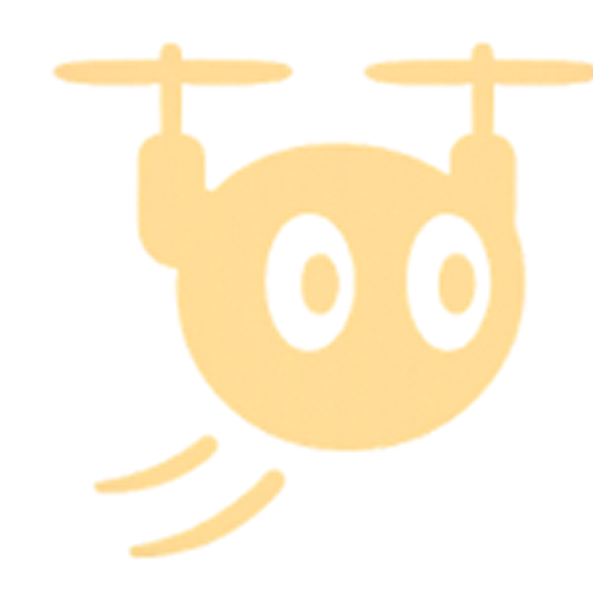

# Drunner - 스마트 러닝 서비스

 

# 목차

1. [프로젝트 개요](#프로젝트-개요)
2. [프로젝트 기간](#프로젝트-기간)
3. [팀원 소개](#팀원-소개)
4. [프로젝트 설계 및 구성](#프로젝트-설계-및-구성)  
   5-1. [서비스 아키텍처](#서비스-아키텍처)  
   5-2. [데이터베이스 설계](#데이터베이스)  
   5-3. [사용 기술](#사용-기술)
5. [주요 기능](#주요-기능)  

 

# 프로젝트 개요
### 🏃‍♀️ 혼자 뛰는 러닝, 아쉬운 점이 있지 않으셨나요?

> 러닝을 하며 **페이스 조절이 어렵고**, **자세 교정이나 피드백을 받기 힘들다**는 점은 많은 러너들의 공통된 고민입니다. 저희는 이러한 문제를 해결하기 위해, **드론을 활용한 스마트 러닝 서비스 `Drunner`** 를 개발했습니다.
>
> 📡 **실시간 자세 분석**, 🕒 **페이스 메이커 기능**, 📱 **운동 기록 관리**까지
> 이제 러닝은 혼자가 아닌, 하늘에서 함께합니다.

 

# 프로젝트 기간

### 2025.04.14 ~ 2025.05.22

 

#  팀원 소개

<table align="center">
  <tr>
    <td align="center" width="17%;">
      
       <b>이건우</b> 
      팀장 
      BE/AI
      
    </td>
    <td align="center" width="17%;">
      
       <b>김본</b> 
      팀원 
      DRONE
      
    </td>
    <td align="center" width="17%;">
      
       <b>유영신</b> 
      팀원 
      DRONE
      
    </td>
    <td align="center" width="17%;">
      
       <b>한슬기</b> 
      팀원 
      BE/INFRA
      
    </td>
    <td align="center" width="17%;">
      
       <b>박해구</b> 
      팀원 
      AOS
      
    </td>
  </tr>
</table>

 

# 프로젝트 설계 및 구성

